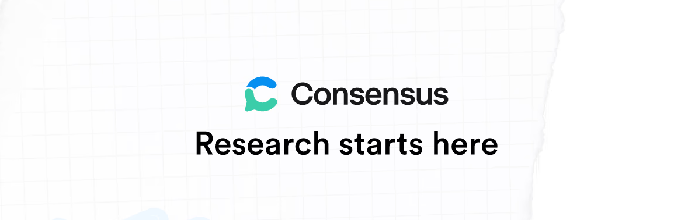

  

**[Consensus](https://consensus.app) is the AI operating system for researchers.** Our AI search engine and reference manager are used by millions of researchers at the world's top institutions, with every answer grounded in 220M+ peer-reviewed papers.

Search, save, cite, build: one place to do serious research, with a native API and MCP underneath.

We're on a mission to make the world's scientific knowledge accessible to everyone who needs it.

- 🔎 **See what the science says**: ask any research question at [consensus.app](https://consensus.app)
- 🤖 **Bring research into your AI assistant**: connect the [Consensus MCP server](https://github.com/Consensus-NLP/consensus-mcp) to Claude, ChatGPT, Cursor, or any MCP client
- 🛠️ **Build with the evidence**: the [Consensus API](https://github.com/Consensus-NLP/consensus-api) puts 220M+ papers behind a single REST call
- 📚 **Go deeper**: guides and API reference at [docs.consensus.app](https://docs.consensus.app)
- 💼 **Help us build it**: we're looking for teammates at [consensus.app/home/careers](https://consensus.app/home/careers/)
- 📣 **Follow along** on [X](https://x.com/ConsensusNLP) and [LinkedIn](https://www.linkedin.com/company/consensus-nlp)
